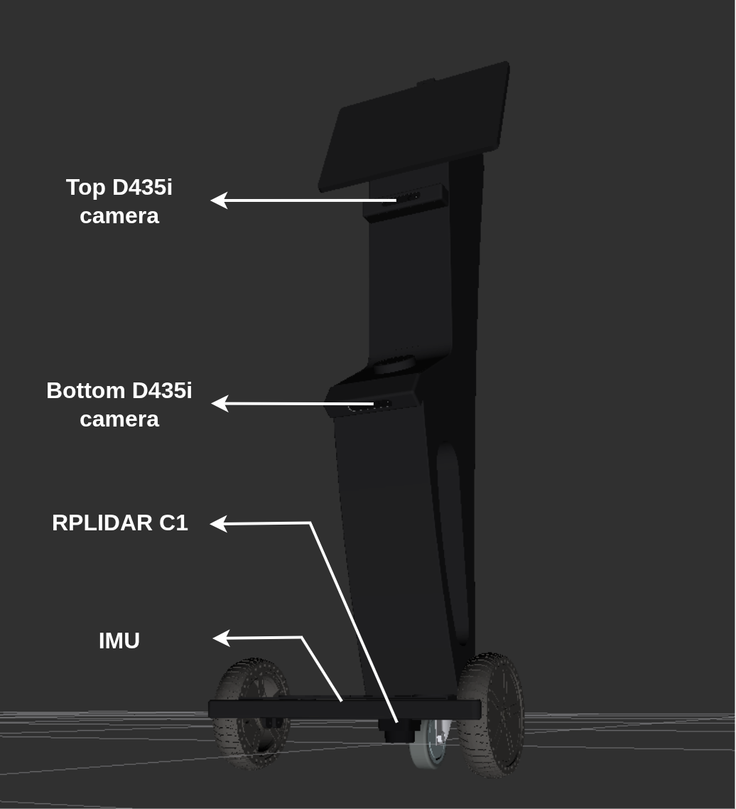

# Introduction

## Navigation Challenge

The simulation platform to be used in this challenge is [Gazebo Harmonic](https://gazebosim.org/docs/harmonic/install_ubuntu/){target=_blank}. Teams are required to develop, test and submit software to successfully complete the task of autonomously navigating the **CAYTU Sito-É** in the restaurant, from its start position to the goal position. 

To attempt this challenge, teams are encouraged to use the [Nav2](https://docs.nav2.org/index.html){target=_blank} navigation framework. The following links provide documentation and tutorials on getting started with Nav2. 

* [Nav2 Getting Started Guide](https://docs.nav2.org/getting_started/index.html){target=_blank}
* [Jazzy - Intermediate - ROS 2 Navigation (Nav2)](https://www.youtube.com/playlist?list=PLNWNEEf8BvG45noktLVI9N0SmD72BpmH7){target=_blank}

## Vision Challenge

**In progress*

Teams are provided with the **CAYTU Sito-É**'s ROS 2 packages and Gazebo environment models (see description below) to enable them develop and test their solutions (see [GitHub Repository](https://github.com/PARC-Robotics/PARC2026-Engineers-League){target=_blank}).

### The CAYTU Sito-É

The **CAYTU Sito-É** is an unmanned ground vehicle (UGV) equipped with different sensors to help you achieve your goal. The sensors are:

* **RPLIDAR C1:** A LiDAR sensor located at the top of the base of the robot. The RPLIDAR C1 publishes on the `/scan` topic.

* **D435i Depth Camera (x2):** One camera is mounted below the monitor the robot and the other towards the robot's base. These cameras publish color data on the topics `/top_camera_color/image_raw` and `/bottom_camera_color/image_raw` and 3D point cloud data on `/top_camera_depth/points` and `/bottom_camera_depth/points`. There are also topics for compressed images which use lower bandwidth compared to the standard raw image. Considering the top D435i camera, these topics are `/top_camera_color/image_raw/compressed` and `/top_camera_color/image_raw/theora`, with similar topics available for the bottom D435i camera as well.

* **IMU:** An IMU sensor is added to the base and publishes on the `/imu` topic.

The figure below shows the Sito-É with the sensors labelled.

<!-- ### Simulation Environment

The simulation environment used in this phase is modeled as a realistic farmland with rough terrain and maize plants and was generated with the [virtual maize field](https://github.com/FieldRobotEvent/virtual_maize_field) ROS package.

 -->

<!-- This phase will evaluate the teams' capabilities to successfully complete these fundamental tasks required to compete in phase 2 (on the physical robot). -->