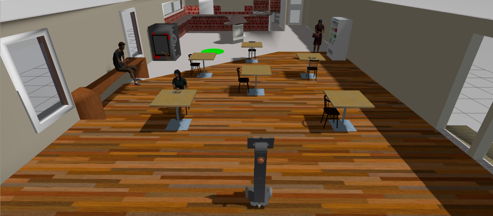
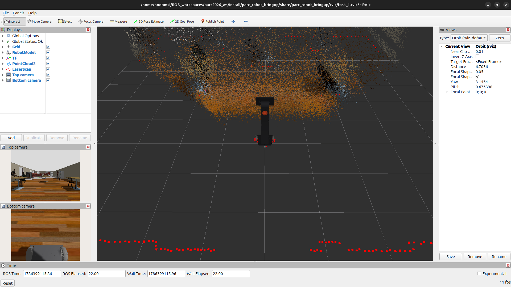

# Défi de Navigation

## Description Générale

<!-- 

Les robots agricoles doivent être capables de se déplacer à travers les cultures et les terres agricoles, notamment en se déplaçant de manière autonome dans les rangs de maïs sur terrain accidenté. Cette tâche consiste à atteindre l'extrémité d'un rang, à effectuer un virage et à revenir dans les rangs adjacents jusqu'à l'objectif. Les équipes doivent développer un logiciel pour guider le robot le long d'un [chemin prédéfini](#explorer-plusieurs-mondes) au sein des rangs, de sa position de départ à son objectif. -->

## Instructions pour la tâche

### Lancement de la tâche
Dans un nouveau terminal, exécutez le fichier de lancement suivant pour lancer le robot dans Gazebo et RViz :

```sh
ros2 launch parc_robot_bringup task_1.launch.py
```

Vous devriez voir l'affichage ci-dessous dans Gazebo et RViz respectivement. Le robot est au centre et, en haut à gauche, le cercle vert représente la position cible.

=== "Gazebo"
    

=== "RViz"
    


### Préparer votre Solution

* Votre solution doit être préparée sous forme de packages ROS à enregistrer dans votre dossier de solutions. Créez un fichier exécutable de nœud dans votre package ROS qui exécute TOUT le code nécessaire à votre solution. Nommez ce fichier : `task_solution.py`.

* Par conséquent, votre solution doit être exécutée en appelant les commandes suivantes :

Dans un terminal :

```sh
ros2 launch parc_robot_bringup task_1.launch.py
```

!!! note
    Veuillez patienter jusqu'à ce que les modèles du monde et du robot soient générés. Ce processus peut prendre plus de temps que d'habitude, surtout lors de la première exécution du programme.

Dans un autre terminal:

```sh
ros2 run <le-nom-de-votre-colis> task_solution.py>
```

Les fichiers de lancement peuvent également être utilisés dans votre solution.

## Règles de Tâche

* Le temps imparti pour accomplir la tâche est de **10 minutes (600 secondes)**.

* La tâche est considérée comme terminée UNIQUEMENT lorsque n'importe quelle partie du robot se trouve à l'intérieur du cercle vert (marqueur de l'objectif).

## Évaluation de l'autonomie

La notation de cette tâche sera basée sur les critères suivants :

| S/N | Critère/Métrique | Description |
| ----------- | ----------- | ------- |
| 1 | **Évitement d'obstacles** | Le robot doit éviter tout contact avec les obstacles. **(Moins de contacts, c'est mieux)** |
| 2 | **Distance finale parcourue jusqu'à l'objectif** | Distance la plus courte parcourue par le robot (mesurée depuis son centre) jusqu'à l'objectif, calculée à la fin du temps imparti [10 minutes]. **(Plus la distance est courte, mieux c'est)**
| 3 | **Durée d'exécution** | Temps écoulé entre le lancement de la solution et la fin de la tâche. **(Plus la durée est courte, mieux c'est)** |