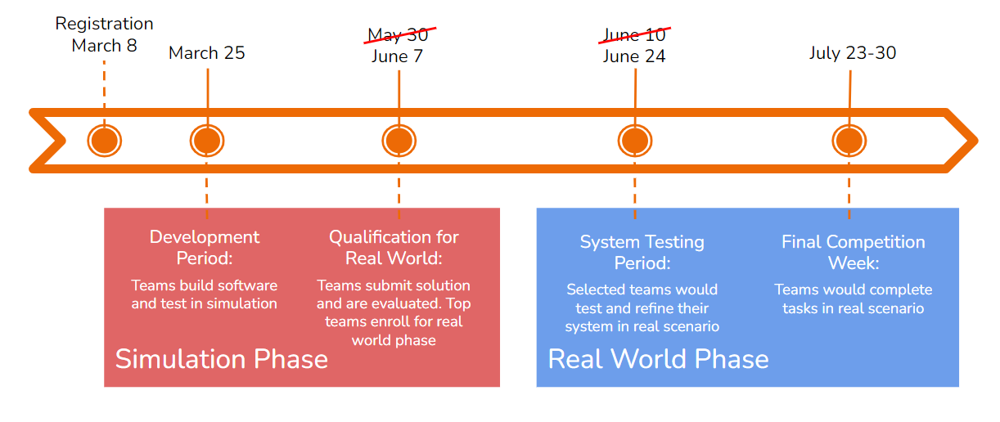

# Dates Importantes

<!--  -->

| Événement | Date |
| --- | --- |
| Début de la compétition | 15e Août 2026 |
| Date limite de soumission pour la phase de simulation | 10e Octobre 2026 |
| Annonce des équipes qualifiées | 17e Octobre 2026 |
| Phase réelle pour les équipes qualifiées (Sénégal) | 3e - 7e Novembre 2026 |

Veuillez noter que toutes les dates sont susceptibles d'être modifiées. Nous vous invitons à consulter régulièrement cette page pour prendre connaissance des mises à jour et vous assurer d'être informé(e) de tout changement. Si vous avez des questions concernant les dates importantes ou si vous avez besoin d'aide pour respecter les échéances, veuillez nous contacter par courriel à l'adresse [info@parcrobotics.org](mailto:info@parcrobotics.org). Nous serons ravis de vous aider.

<!-- Rejoignez également le serveur Discord de la PARC Engineers League en suivant ce [lien](https://discord.gg/yFqDYk9hvk). Vous y trouverez des informations sur les différents parcours, les dates des ateliers, les problèmes de dépannage et les demandes d'ordre général. -->
