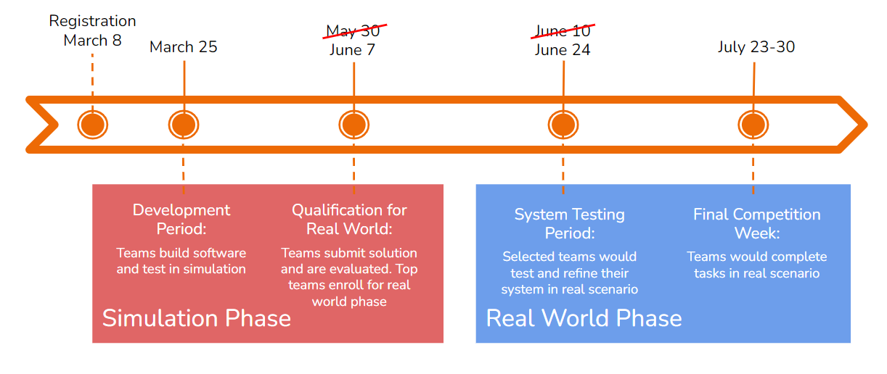

# Important Dates

<!--  -->

| Event | Date |
| --- | --- |
| Competition Begins | August 15th 2026 |
| Simulation Phase Submission Deadline | October 2026 (Date to be confirmed) |
| Qualified Teams Announced | TBD |
| Real World Phase for Qualified Teams (Senegal) | November 2026 |

Please note that all dates are subject to change. We encourage you to check this page regularly for updates and to ensure that you are aware of any changes that may occur. If you have any questions about the important dates or need assistance with meeting any of the deadlines, please contact us through email at [info@parcrobotics.org](mailto:info@parcrobotics.org). We will be happy to assist you in any way we can.

<!-- Also, please join the PARC Engineers League Discord server by following this [link](https://discord.gg/yFqDYk9hvk). Information about the different tracks, workshop dates, troubleshooting issues and general inquiries will be shared there. -->
